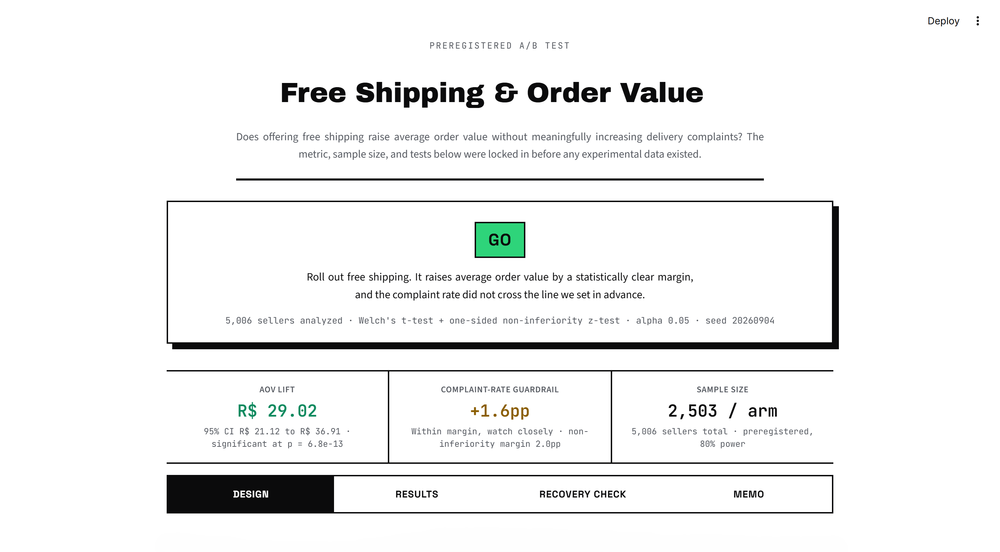
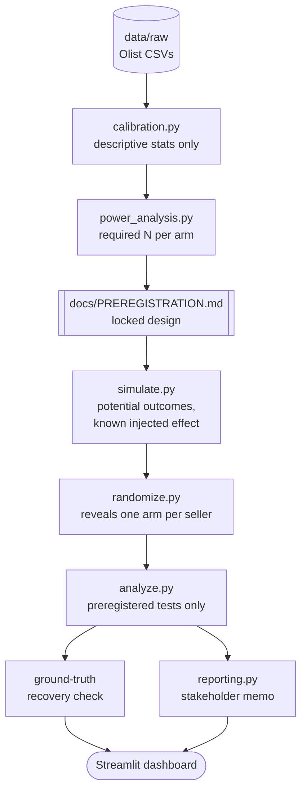

# Experiment Design & Power Analysis for a Shipping Policy Change

A preregistered, simulated A/B testing pipeline that evaluates whether offering free shipping increases average order value without meaningfully increasing delivery-complaint rates, with the metric, MDE, sample size, and statistical tests locked before any experimental data exists.

Built as a portfolio project calibrated from the real public Olist Brazilian E-Commerce dataset. The experiment itself is entirely simulated: no hypothesis test in this project runs against real, unrandomized orders.

## Preview

<p align="center">
  
  <br>
  <sub>Main landing view: Final verdict and all four tabs.</sub>
</p>

> Additional screenshots and example memo in [`assets/`](assets/).

## What this is

Given a business question, "does free shipping raise AOV without hurting satisfaction?", the project:

1. Calibrates realistic simulation parameters from real Olist order data using descriptive statistics only.
2. Computes the required sample size and locks the metric, MDE, and test choice into `docs/PREREGISTRATION.md` before any simulation code exists.
3. Simulates a population with a known injected effect using potential outcomes, creating a ground truth against which the analysis can be checked.
4. Randomizes sellers into treatment and control arms, revealing exactly one potential outcome per seller and discarding the counterfactual.
5. Runs exactly the preregistered tests once, at the preregistered sample size.
6. Separately checks the analysis against the known injected effect.
7. Generates a stakeholder memo and live dashboard from the analysis output only.

The project deliberately separates **design** from **experiment**. Everything under `design/` establishes and locks the experimental design before simulated data exists. Everything under `experiment/` executes that locked design without modifying it.

## Architecture



Full section-by-section design rationale is documented in [`docs/PREREGISTRATION.md`](docs/PREREGISTRATION.md).

## Design decisions

| Decision             | Choice                                    | Why                                                         |
| -------------------- | ----------------------------------------- | ----------------------------------------------------------- |
| Primary metric       | Mean per-seller AOV                       | Matches the unit of randomization                           |
| Primary MDE          | R$25 absolute lift                        | Grounded in the ~R$23 average freight cost a seller absorbs |
| Guardrail metric     | Delivery-complaint rate, review score ≤ 2 | Prevents an AOV win from masking a satisfaction loss        |
| Guardrail margin     | 2.0pp non-inferiority                     | Represents an approximately 15% relative increase           |
| Randomization unit   | Seller, not order                         | Avoids violating SUTVA within a seller's order stream       |
| Primary test         | Welch's t-test                            | Allows for unequal variance between arms                    |
| Guardrail test       | One-sided, margin-shifted z-test, seller-clustered | Tests non-inferiority against the margin directly, not just against zero |
| Required sample size | 2,503 sellers/arm, 5,006 total            | The primary metric is the binding constraint                |

## Guardrails

* **No peeking.** `analyze()` raises `PartialDatasetError` unless it receives exactly the preregistered sample size per arm. This prevents repeated interim testing and stopping when `p < 0.05`.
* **Dataset-role enforcement.** `analyze.py` and `reporting.py` cannot read raw Olist data or the known injected effect. This is verified with an AST-level test.
* **Ground-truth isolation.** The injected effect is written by `simulate.py` and read only by `check_ground_truth_recovery()`, after the main analysis has already returned.
* **Zero-leakage randomization.** `randomize.py` reveals exactly one potential outcome per seller and removes the counterfactual columns before the analysis dataset is written.
* **Immutable preregistration.** `docs/PREREGISTRATION.md` is locked before the experiment pipeline runs and is never regenerated by the pipeline.

## Data

* **`data/raw/`** contains the real Olist CSVs. They are user-supplied and gitignored. They are used only by `calibration.py` for descriptive statistics.
* **`data/calibration/`** contains the committed `calibration_params.json`, which is the only bridge between the real dataset and the simulation. It contains category weights, AOV distribution parameters, and the baseline complaint rate.
* **`data/simulated/`** contains the synthetic population and randomized assignment. These files are regenerable from the fixed seed and are gitignored, except for the committed `true_effects.json`.
* **`results/`** contains the power analysis, analysis results, recovery check, and stakeholder memo.

The Olist dataset is reused from other portfolio projects, but its role here is strictly limited to simulation calibration. No hypothesis test is performed against it.

## Project structure

```text
.
├── README.md
├── requirements.txt
├── .gitignore
│
├── docs/
│   └── PREREGISTRATION.md       # locked experimental design
│
├── .streamlit/
│   └── config.toml              # dashboard theme
│
├── assets/
├── data/
│   ├── raw/                     # Olist CSVs, user supplied, gitignored
│   ├── calibration/             # committed calibration_params.json
│   └── simulated/               # regenerable simulation data
│
├── src/
│   ├── design/
│   │   ├── calibration.py       # descriptive calibration
│   │   └── power_analysis.py    # sample-size calculation
│   │
│   └── experiment/
│       ├── simulate.py          # potential outcomes
│       ├── randomize.py         # treatment assignment
│       ├── analyze.py           # preregistered analysis
│       └── reporting.py         # stakeholder reporting
│
├── dashboard/
│   └── app.py                   # Streamlit results dashboard
│
├── results/
│   ├── power_analysis.json
│   ├── analysis_results.json
│   ├── recovery_check.json
│   └── stakeholder_memo.*
│
├── scripts/
│   └── run_pipeline.py
│
└── tests/
```

The separation between `design/` and `experiment/` is intentional. `design/` establishes what the experiment is allowed to do; `experiment/` executes that design afterward.

## Getting started

### 1. Data

The committed `data/calibration/calibration_params.json` is sufficient to run the experiment pipeline, so the raw Olist CSVs are not required unless you want to regenerate the calibration.

To recalibrate from the original dataset, download the Olist Brazilian E-Commerce dataset and place these files in `data/raw/`:

```text
olist_orders_dataset.csv
olist_order_items_dataset.csv
olist_order_reviews_dataset.csv
olist_products_dataset.csv
product_category_name_translation.csv
```

### 2. Install

```bash
python -m venv .venv
source .venv/bin/activate
pip install -r requirements.txt
```

No package installation step is required for the project itself. `scripts/run_pipeline.py`, `dashboard/app.py`, and the test suite add `src/` to `sys.path`.

To run a module directly from outside the repository root:

```bash
PYTHONPATH=src python -m design.calibration
```

### 3. Run

```bash
python scripts/run_pipeline.py
streamlit run dashboard/app.py
pytest tests/ -v
```

By default, the pipeline reuses the committed calibration parameters. To rebuild them from `data/raw/`:

```bash
python scripts/run_pipeline.py --recalibrate
```

The pipeline executes:

```text
power → simulate → randomize → analyze → report
```

It never regenerates or modifies `docs/PREREGISTRATION.md`.

## Evaluation

`tests/` is the project's core differentiator, not a checkbox.

* **`test_power_analysis.py`** validates the power calculation against a known textbook example, Cohen's d = 0.5 → approximately 64 observations per arm.
* **`test_randomization_balance.py`** checks treatment/control balance across repeated seeds and verifies that counterfactual columns do not leak into the analysis dataset.
* **`test_stopping_rule.py`** confirms that `analyze()` rejects partial or over-accrued datasets.
* **`test_recovery_check_catches_bugs.py`** is a mutation test that deliberately breaks randomization and verifies that the ground-truth recovery check detects the resulting error.
* **`test_no_raw_data_leak.py`** uses AST inspection to verify that raw data and the known injected effect cannot reach `analyze.py` or `reporting.py`.
* **`test_memo_rendering.py`** protects against a real Streamlit markdown-rendering bug that silently broke currency formatting.
* **`test_guardrail_clustering_fix.py`** pins the guardrail-test fix (`docs/PREREGISTRATION.md` section 8 amendment): the unit of analysis is the seller, not the order, and the breach decision tests the preregistered margin directly rather than a from-zero p-value combined with a separate point-estimate check.

Current committed status: **26/26 tests passing** (`test_power_analysis.py`'s 4 tests are unmodified by the guardrail fix; `pyflakes` clean on all touched files).

## Results

The committed simulation injects:

* **AOV lift:** R$28.00
* **Complaint-rate increase:** 1.2 percentage points

The preregistered analysis recovered the primary metric; the guardrail's confidence interval narrowly missed its true injected value:

| Metric                    | Point estimate | 95% CI             | True value | Recovered? |
| ------------------------- | -------------: | ------------------ | ---------: | ---------- |
| AOV lift                  |        R$29.02 | [R$21.12, R$36.91] |    R$28.00 | Yes        |
| Complaint rate difference |        +2.32pp | [+1.25pp, +3.38pp] |    +1.20pp | No         |

The primary interval contains the true injected effect. The guardrail interval misses it by a very small margin relative to its own width (well under 0.1 standard errors outside the boundary), consistent with the roughly 5% miss rate expected from a nominal 95% confidence interval.

**The guardrail decision itself changed as a direct result of fixing the clustering issue below, from GO to NO-GO.** Under the original, order-pooled analysis, the observed gap was +1.60pp, under the preregistered margin. Under the corrected, seller-clustered analysis (`docs/PREREGISTRATION.md` section 8 amendment), the same underlying data produces +2.32pp, over the 2.0pp margin, and the guardrail is breached. This is not the old analysis being "right" and the new one "wrong," or vice versa: both estimators are unbiased for the true, constant per-seller effect in expectation, but the seller-clustered estimator has substantially higher variance here, because the population has many low-order-count sellers (right-skewed orders-per-seller distribution) that the unweighted, seller-level analysis counts equally alongside high-volume sellers, each contributing a noisier, more volatile per-seller complaint rate. The old order-pooled analysis implicitly downweighted exactly those noisy, low-volume sellers by weighting each order equally instead, which is also why its confidence interval was too narrow (anti-conservative). On this specific seeded run, that extra variance pushed the point estimate over the line. This is the honest, if uncomfortable, output of fixing a real statistical bias: a guardrail methodology that better reflects the actual randomization unit surfaced a signal the previous, anti-conservative methodology was masking.

This is one seeded simulation run, not evidence that the method generalizes to every possible real-world effect.

## Known limitations

* **Recovery is necessary, not sufficient.** A single seeded confidence interval is expected to contain the true effect roughly 95% of the time. Passing or failing that check alone does not establish that the method is correct or generalizes.
* **Seller-level randomization assumes no cross-seller interference.** Competition for the same customers or marketplace-level effects could cause treatment effects to leak between arms.
* **Guardrail test power sizing stays order-level.** `power_analysis.py` still sizes the guardrail using a pooled, order-level proportions test, deliberately as a conservative (not undersized) planning approximation (see `docs/PREREGISTRATION.md` section 4). The actual analysis (`analyze.py`) now uses a seller-clustered, margin-shifted non-inferiority test that matches the randomization unit; a fully matched seller-level power calculation would require per-seller complaint-rate variance from the raw data, which this project's calibration step does not currently compute.
* **Calibration is marketplace-specific.** The baseline AOV distributions and complaint rates reflect Olist's category mix and the Brazilian market and may not generalize to another marketplace, geography, or time period.
* **The seller-clustered guardrail estimator is unweighted by design, and therefore sensitive to low-order-count sellers.** Each seller's complaint rate counts equally regardless of how many orders it's estimated from, which is the statistically correct match to the seller-level randomization unit, but means a seller with very few orders contributes a noisy, high-variance rate on equal footing with a high-volume seller. That's a real driver of the wider (and more honest) confidence interval in the Results section above, and of the guardrail verdict changing on this seeded run. A seller-level mixed-effects or GEE model, or a minimum-orders-per-seller inclusion threshold, would be a more robust next step than the current unweighted mean-of-rates estimator.
