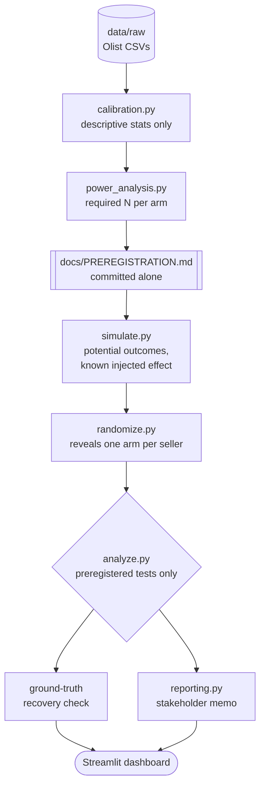

# Experiment Design & Power Analysis for a Shipping Policy Change

A preregistered, simulated A/B test on whether free shipping raises average
order value without meaningfully hurting delivery-complaint rates, with the
entire design (metric, MDE, sample size, tests) locked into git *before* a
single row of experimental data existed.

Built as a portfolio project calibrated from a real public dataset, but the
experiment itself is fully simulated: no hypothesis test in this project ever
runs against real, unrandomized orders.

## Preview

Screenshots aren't committed to this repo yet. Run the dashboard locally
(`streamlit run dashboard/app.py` after the pipeline has populated
`results/`) to see it live:

- **Landing view** — the GO/NO-GO verdict banner and three headline metrics
  (AOV lift, guardrail status, sample size) are visible immediately, no tab
  click required.
- **Simulated Results tab** — order value and guardrail bar charts by arm,
  with the preregistered non-inferiority ceiling drawn in.

If you add screenshots later, drop them in `docs/screenshots/` and link
them here as `ui-landing.png` / `ui-results.png`.

## What this is

Given a business question (does free shipping raise AOV without hurting
satisfaction), the project:

1. Calibrates realistic simulation parameters from real Olist order data,
   descriptive statistics only, never a hypothesis test.
2. Computes the required sample size from those calibration numbers alone,
   and locks metric, MDE, and test choice into `docs/PREREGISTRATION.md`,
   committed to git before any simulation code exists.
3. Simulates a population with a known, injected effect using potential
   outcomes, so a ground truth exists to check the analysis against.
4. Randomizes sellers into arms, revealing exactly one potential outcome per
   seller and physically discarding the other.
5. Runs exactly the preregistered tests, once, on the full sample, then
   separately checks the result against the known injected effect.
6. Reports through a plain-language stakeholder memo and a live dashboard,
   both generated from the analysis output only.

## Build-order proof

Most "A/B test" write-ups skip straight to the analysis. The actual
discipline of experimentation is in what happens *before* you see any data,
and this project enforces that order literally, through git history, not
just prose:

```
7ba1f90 Preregister design: metric, MDE, power analysis, before any
        simulation code exists
70722c0 Simulate population, randomize, and run preregistered analysis
```

`PREREGISTRATION.md` and the power analysis were committed in isolation
*before* the simulation, randomization, or analysis code existed. Nothing in
the design could have been fit to a result, because no result existed yet.
Every commit after `70722c0` (documentation, a calibration bug fix, a move
to `docs/PREREGISTRATION.md`, other repo restructurings) leaves the file's
*content* untouched — `git log --follow` tracks it through the rename, and
`git show 7ba1f90:PREREGISTRATION.md` (its path at that commit) still
matches the current `docs/PREREGISTRATION.md` byte for byte.

## Pipeline



Full section-by-section design rationale, written and locked before any of
this ran: [`docs/PREREGISTRATION.md`](docs/PREREGISTRATION.md).

## Design decisions

| Decision | Choice | Why |
|---|---|---|
| Primary metric | Mean per-seller AOV | Matches the unit of randomization; see `docs/PREREGISTRATION.md` §2 |
| Primary MDE | R$25 absolute lift | Grounded in the ~R$23 average freight cost a seller absorbs; a smaller lift can't cover its own cost |
| Guardrail metric | Delivery-complaint rate (review score ≤ 2) | Prevents an AOV win from masking a satisfaction loss |
| Guardrail margin | 2.0pp non-inferiority | ~15% relative increase; the threshold past which the satisfaction cost plausibly outweighs the AOV gain |
| Randomization unit | Seller, not order | Order-level randomization would violate SUTVA within a seller's own order stream |
| Primary test | Welch's t-test | A shipping-cost change plausibly creates unequal variance between arms |
| Guardrail test | One-sided two-proportion z-test | The business question is non-inferiority, not two-sided |
| Required sample size | 2,499 sellers/arm (4,998 total) | Binding constraint is the primary metric, not the guardrail |

## Guardrails

- **No-peeking enforcement.** `analyze()` raises `PartialDatasetError` on
  anything but the exact preregistered N per arm, checked in
  `tests/test_stopping_rule.py`. Checking a running experiment repeatedly and
  stopping at the first `p < 0.05` inflates the true false-positive rate well
  above 5%; this project makes exactly one inferential claim, at a
  pre-committed sample size, instead.
- **Dataset-role enforcement.** No function in `analyze.py` or `reporting.py`
  can read raw Olist data or the known injected effect, verified with an AST
  inspection in `tests/test_no_raw_data_leak.py`, not just a comment saying so.
- **Ground-truth isolation.** The known injected effect is written once by
  `simulate.py` and read only by `check_ground_truth_recovery()`, after
  `analyze()` has already returned a result from data that never saw it.
- **Zero-leakage randomization.** `randomize.py` reveals exactly one
  potential outcome per seller and physically drops the counterfactual
  columns from the file `analyze.py` reads, asserted in code, not assumed.
- **Immutable preregistration.** `docs/PREREGISTRATION.md` is never edited after
  its first commit; every later change to this project is diffed against
  `git show 7ba1f90:docs/PREREGISTRATION.md` before shipping.

## Data

- **`data/raw/`** real Olist CSVs, user-supplied and gitignored. Used only by
  `calibration.py` for descriptive statistics: category-level order-value
  distributions and baseline complaint rates. No hypothesis test in this
  project runs against this data.
- **`data/calibration/`** `calibration_params.json`, committed. The only
  bridge between real data and the simulation: category weights, AOV
  mean/std, baseline complaint rate.
- **`data/simulated/`** the synthetic population and randomized
  assignment, regenerable deterministically from a fixed seed, gitignored
  (except `true_effects.json`, which is committed - it's small, and the
  ground-truth recovery check needs it even in a fresh checkout).
- **`results/`** power analysis, analysis results, recovery check, and memo,
  committed.

The Olist dataset also appears in other, unrelated projects in this
portfolio; that reuse is deliberate (a convenient, realistic, public
e-commerce dataset), not an oversight, and here its role is strictly limited
to calibration.

## Project structure

```
.
├── README.md
├── requirements.txt              # sole source of dependency truth
├── .gitignore
│
├── docs/
│   └── PREREGISTRATION.md       # locked design doc, see build-order proof above
│
├── .streamlit/config.toml       # dashboard theme
│
├── assets/
├── data/
│   ├── raw/                     # you supply the Olist CSVs here, gitignored
│   ├── calibration/             # calibration_params.json, committed
│   └── simulated/               # regenerable from the seed; true_effects.json committed
│
├── src/
│   ├── design/                  # runs BEFORE any experimental data exists
│   │   ├── calibration.py       # step 0.5
│   │   └── power_analysis.py    # step 1-2
│   └── experiment/              # runs AFTER the design is locked
│       ├── simulate.py          # step 4
│       ├── randomize.py         # step 5
│       ├── analyze.py           # step 6
│       └── reporting.py         # step 7
│
├── dashboard/app.py             # live results, Streamlit
├── results/                     # power analysis, analysis results, memo, committed
│
├── scripts/run_pipeline.py      # runs the pipeline steps in order
└── tests/                       # see Evaluation below
```

`design/` and `experiment/` are two separate top-level packages under `src/`,
not one package with subpackages - the split mirrors the project's actual
thesis: everything in `design/` is what gets locked into
`docs/PREREGISTRATION.md` before any simulated data exists; everything in
`experiment/` runs after that commit and never modifies it.

## Getting started

1. **Data.** `data/calibration/calibration_params.json` is already
   committed, so you don't need the raw CSVs to run anything past
   calibration. To re-derive calibration from scratch, download the
   [Olist Brazilian E-Commerce dataset](https://www.kaggle.com/datasets/olistbr/brazilian-ecommerce)
   and place `olist_orders_dataset.csv`, `olist_order_items_dataset.csv`,
   `olist_order_reviews_dataset.csv`, `olist_products_dataset.csv`, and
   `product_category_name_translation.csv` in `data/raw/`.

2. **Set up a virtual environment and install dependencies**
   ```bash
   python3 -m venv .venv
   source .venv/bin/activate        # Windows: .venv\Scripts\activate
   pip install -r requirements.txt
   ```
   This is enough to run everything below - `scripts/run_pipeline.py`,
   `dashboard/app.py`, and `pytest` all add `src/` to `sys.path`
   themselves, so `design` and `experiment` are importable without
   installing this project as a package. There is no `pyproject.toml`;
   `requirements.txt` is the sole dependency manifest.

   To run a module directly from outside the repo root (e.g.
   `python3 -m design.calibration` from another directory), set
   `PYTHONPATH` instead of installing a package:
   ```bash
   PYTHONPATH=src python3 -m design.calibration
   ```

## Running it

```bash
python3 scripts/run_pipeline.py   # power -> simulate -> randomize -> analyze -> report
streamlit run dashboard/app.py    # live results dashboard
python3 -m pytest tests/          # 23 tests, see Evaluation below
```

By default the pipeline skips calibration and reuses the committed
`data/calibration/calibration_params.json`, so the raw Olist CSVs are not
required to run it. Pass `--recalibrate` to rebuild calibration from
`data/raw/` instead (requires the CSVs described in "Getting started").

`scripts/run_pipeline.py` doesn't require any package install first (there
is no `pyproject.toml`; it puts `src/` on `sys.path` itself).
`docs/PREREGISTRATION.md` is already written and committed; the pipeline
never regenerates it.

## Evaluation

`tests/` is this project's core differentiator, not a checkbox.

- **`test_power_analysis.py`** validates the power calculation against a
  known textbook example (Cohen's d = 0.5 → n ≈ 64 per arm).
- **`test_randomization_balance.py`** checks arms stay balanced across
  repeated seeds and that no counterfactual column leaks into the revealed
  dataset.
- **`test_stopping_rule.py`** confirms `analyze()` rejects a partial or
  over-accrued dataset instead of silently running on it.
- **`test_recovery_check_catches_bugs.py`** is a mutation test: it
  deliberately confounds the randomization and confirms the recovery check
  actually fails, proving the check can catch a real bug and isn't passing
  by construction.
- **`test_no_raw_data_leak.py`** is an AST-level check that raw data and the
  known injected effect never reach `analyze()` or `reporting.py` through
  any path except the one function whose entire job is the recovery check.
- **`test_memo_rendering.py`** is a regression test for a real bug found via
  screenshot review: Streamlit's markdown renderer treats paired `$`
  characters as LaTeX math, which silently broke the memo's currency
  formatting.

23/23 passing, `pyflakes` clean.

This is the headline result: the simulated population has a true injected
AOV lift of R$28.00 and a true injected complaint-rate increase of 1.2
percentage points, and `test_recovery_check_catches_bugs.py` confirms the
recovery check can actually detect a wrong answer rather than passing by
construction. On the committed run (`results/analysis_results.json`,
`results/recovery_check.json`), the preregistered analysis recovered the
primary metric but not the guardrail:

| | Point estimate | 95% CI | True value | Recovered? |
|---|---|---|---|---|
| AOV lift | R$29.02 | [R$21.12, R$36.91] | R$28.00 | Yes |
| Complaint rate diff | +1.60pp | [+1.27pp, +1.93pp] | +1.20pp | No |

The primary interval contains its true injected value; the guardrail
interval narrowly misses it (true value sits just below the CI's lower
bound). This is expected roughly one seeded run in twenty even for a
correctly-built method, and this project makes exactly one such run - see
"Recovery is necessary, not sufficient" below. The guardrail decision itself
is unaffected: the non-inferiority test still correctly did not flag a
breach of the 2.0-point margin, since +1.60pp stayed under it. This is one
seeded run, not proof the method generalizes to every possible effect - see
limitations below.

## Known limitations

- **Recovery is necessary, not sufficient.** A single seeded run's CI is
  expected to contain the true effect roughly 95% of the time by
  construction, even for a correctly-built method; on the committed run the
  primary metric's CI contains the true value and the guardrail's does not.
  Neither outcome is diagnostic on its own - the primary result passing is a
  smoke test that the pipeline isn't obviously broken, and the guardrail
  result missing is within the ~5% expected miss rate, not evidence of a
  bug (`test_recovery_check_catches_bugs.py` separately confirms the check
  can detect an actual bug when one is injected). Neither is proof the
  method generalizes to every real, unknown effect size.
- **Seller-level randomization assumes no cross-seller interference.** If
  sellers compete for the same limited customer pool, or if Olist's own
  marketing shifts customers toward whichever sellers currently offer free
  shipping, that would leak treatment effect across arms and bias the
  estimate. Real deployment would need to check for this.
- **Guardrail test clustering simplification.** The guardrail test pools
  order-level complaint counts by arm rather than using a seller-clustered or
  cluster-robust estimator, understating the true standard error. This is
  anti-conservative (slightly more likely to flag a guardrail breach than a
  fully rigorous version would), documented in `docs/PREREGISTRATION.md` §8, and
  left as a known simplification rather than fixed, since it does not change
  this run's conclusion.
- **Calibration reflects Olist's category mix and Brazil's market.** Baseline
  AOV distributions and complaint rates may not generalize to a different
  marketplace, region, or time period.


