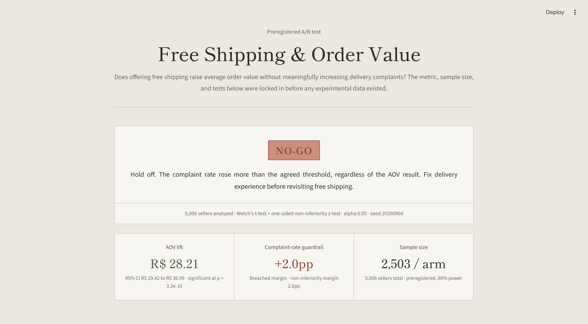
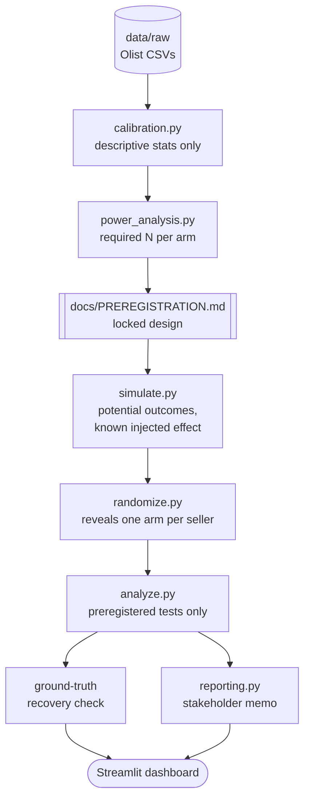

# Experiment Design & Power Analysis for a Shipping Policy Change

A preregistered, simulated A/B testing pipeline that evaluates whether offering free shipping increases average order value without meaningfully increasing delivery-complaint rates, with the metric, MDE, sample size, and statistical tests locked before any experimental data exists.

Built as a portfolio project calibrated from the real public Olist Brazilian E-Commerce dataset. The experiment itself is entirely simulated: no hypothesis test in this project runs against real, unrandomized orders.

## Preview

<p align="center">
  
  <br>
  <sub>Main landing view: Final verdict and all four tabs.</sub>
</p>

> Additional screenshots and example memo in [`assets/`](assets/).

## What this is

Given a business question, "does free shipping raise AOV without hurting satisfaction?", the project:

1. Calibrates realistic simulation parameters from real Olist order data using descriptive statistics only.
2. Computes the required sample size and locks the metric, MDE, and test choice into `docs/PREREGISTRATION.md` before any simulation code exists.
3. Simulates a population with a known injected effect using potential outcomes, creating a ground truth against which the analysis can be checked.
4. Randomizes sellers into treatment and control arms, revealing exactly one potential outcome per seller and discarding the counterfactual.
5. Runs exactly the preregistered tests once, at the preregistered sample size.
6. Separately checks the analysis against the known injected effect.
7. Generates a stakeholder memo and live dashboard from the analysis output only.

The project deliberately separates **design** from **experiment**. Everything under `design/` establishes and locks the experimental design before simulated data exists. Everything under `experiment/` executes that locked design without modifying it.

## Architecture


```mermaid
flowchart TD
    raw[(data/raw\nOlist CSVs)] --> calib[calibration.py\ndescriptive stats only]
    calib --> power[power_analysis.py\nrequired N per arm]
    power --> prereg[[docs/PREREGISTRATION.md\nlocked design]]
    prereg --> sim[simulate.py\npotential outcomes,\nknown injected effect]
    sim --> rand[randomize.py\nreveals one arm per seller]
    rand --> analyze[analyze.py\npreregistered tests only]
    analyze --> recovery[ground-truth\nrecovery check]
    analyze --> memo[reporting.py\nstakeholder memo]
    recovery --> dash([Streamlit dashboard])
    memo --> dash
```

Full section-by-section design rationale is documented in [`docs/PREREGISTRATION.md`](docs/PREREGISTRATION.md).

## Design decisions

| Decision             | Choice                                    | Why                                                         |
| -------------------- | ----------------------------------------- | ----------------------------------------------------------- |
| Primary metric       | Mean per-seller AOV                       | Matches the unit of randomization                           |
| Primary MDE          | R$25 absolute lift                        | Grounded in the ~R$23 average freight cost a seller absorbs |
| Guardrail metric     | Delivery-complaint rate, review score ≤ 2 | Prevents an AOV win from masking a satisfaction loss        |
| Guardrail margin     | 2.0pp non-inferiority                     | Represents approximately a 15.7% relative increase          |
| Randomization unit   | Seller, not order                         | Avoids violating SUTVA within a seller's order stream       |
| Primary test         | Welch's t-test                            | Allows for unequal variance between arms                    |
| Guardrail test       | One-sided, margin-shifted z-test, seller-clustered | Tests non-inferiority against the margin directly, not just against zero |
| Required sample size | 2,503 sellers/arm, 5,006 total            | The primary metric is the binding constraint                |

## Guardrails

* **No peeking.** `analyze()` raises `PartialDatasetError` unless it receives exactly the preregistered sample size per arm. This prevents repeated interim testing and stopping when `p < 0.05`.
* **Dataset-role enforcement.** `analyze.py` and `reporting.py` cannot read raw Olist data or the known injected effect. This is verified with an AST-level test.
* **Ground-truth isolation.** The injected effect is written by `simulate.py` and read only by `check_ground_truth_recovery()`, after the main analysis has already returned.
* **Zero-leakage randomization.** `randomize.py` reveals exactly one potential outcome per seller and removes the counterfactual columns before the analysis dataset is written.
* **Balanced assignment enforced.** `randomize()` raises a `ValueError` on an odd seller count instead of silently giving control one extra seller.
* **Immutable preregistration.** `docs/PREREGISTRATION.md` is locked before the experiment pipeline runs and is never regenerated by the pipeline.

## Data

* **`data/raw/`** contains the real Olist CSVs. They are user-supplied and gitignored. They are used only by `calibration.py` for descriptive statistics.
* **`data/calibration/`** contains the committed `calibration_params.json`, which is the only bridge between the real dataset and the simulation. It contains AOV distribution parameters, the baseline complaint rate, and two distinct category-weight fields: `category_weights` (each category's share of orders) and `category_weights_seller_level` (each category's share of sellers). `simulate.py` uses the seller-level weights to draw a simulated seller's category, since the unit being drawn is a seller, not an order; using the order-level weights for that would overweight categories where individual sellers place many orders each.
* **`data/simulated/`** contains the synthetic population and randomized assignment. These files are regenerable from the fixed seed and are gitignored, except for the committed `true_effects.json`.
* **`results/`** contains the power analysis, analysis results, recovery check, and stakeholder memo.

The Olist dataset is reused from other portfolio projects, but its role here is strictly limited to simulation calibration. No hypothesis test is performed against it.

## Project structure

```text
.
├── README.md
├── requirements.txt
├── .gitignore
│
├── docs/
│   └── PREREGISTRATION.md       # locked experimental design
│
├── .streamlit/
│   └── config.toml              # dashboard theme
│
├── assets/
├── data/
│   ├── raw/                     # Olist CSVs, user supplied, gitignored
│   ├── calibration/             # committed calibration_params.json
│   └── simulated/               # regenerable simulation data
│
├── src/
│   ├── design/
│   │   ├── calibration.py       # descriptive calibration
│   │   └── power_analysis.py    # sample-size calculation
│   │
│   └── experiment/
│       ├── simulate.py          # potential outcomes
│       ├── randomize.py         # treatment assignment
│       ├── analyze.py           # preregistered analysis
│       └── reporting.py         # stakeholder reporting
│
├── dashboard/
│   └── app.py                   # Streamlit results dashboard
│
├── results/
│   ├── power_analysis.json
│   ├── analysis_results.json
│   ├── recovery_check.json
│   └── memo.md
│
├── scripts/
│   └── run_pipeline.py
│
└── tests/
```

The separation between `design/` and `experiment/` is intentional. `design/` establishes what the experiment is allowed to do; `experiment/` executes that design afterward.

## Getting started

### 1. Data

The committed `data/calibration/calibration_params.json` is sufficient to run the experiment pipeline, so the raw Olist CSVs are not required unless you want to regenerate the calibration.

To recalibrate from the original dataset, download the Olist Brazilian E-Commerce dataset and place these files in `data/raw/`:

```text
olist_orders_dataset.csv
olist_order_items_dataset.csv
olist_order_reviews_dataset.csv
olist_products_dataset.csv
product_category_name_translation.csv
```

### 2. Install

Developed and tested on Python 3.11.9.

```bash
python -m venv .venv
source .venv/bin/activate
pip install -r requirements.txt
```

No package installation step is required for the project itself. `scripts/run_pipeline.py`, `dashboard/app.py`, and the test suite add `src/` to `sys.path`.

To run a module directly from outside the repository root:

```bash
PYTHONPATH=src python -m design.calibration
```

### 3. Run

```bash
python scripts/run_pipeline.py
streamlit run dashboard/app.py
pytest tests/ -v
```

By default, the pipeline reuses the committed calibration parameters. To rebuild them from `data/raw/`:

```bash
python scripts/run_pipeline.py --recalibrate
```

The pipeline executes:

```text
power → simulate → randomize → analyze → report
```

It never regenerates or modifies `docs/PREREGISTRATION.md`. Run the pipeline before launching the dashboard; until `results/` exists, the dashboard shows a prompt instead of results.

## Evaluation

The test suite is the project's core evidence: 30 tests, all passing on Python 3.11.9, with `pyflakes` reporting no warnings.

| Test file                             | What it protects                                                                                     |
| ------------------------------------- | ---------------------------------------------------------------------------------------------------- |
| `test_power_analysis.py`              | Power maths matches a textbook case (Cohen's d = 0.5 needs about 64 per arm) and uses calibration inputs only |
| `test_randomization_balance.py`       | Arms balance across seeds, no counterfactual columns leak, odd-sized populations are rejected        |
| `test_stopping_rule.py`               | `analyze()` rejects partial and over-accrued datasets                                                |
| `test_recovery_check_catches_bugs.py` | Mutation test: a deliberately broken randomization is caught by the recovery check                   |
| `test_no_raw_data_leak.py`            | AST checks: raw Olist data and the injected effect cannot reach `analyze.py` or `reporting.py`       |
| `test_memo_rendering.py`              | Currency survives Streamlit markdown rendering and always shows two decimals                         |
| `test_guardrail_clustering_fix.py`    | The guardrail uses the seller as its unit and tests the preregistered margin directly                |
| `test_calibration_category_weights.py`| Seller-level and order-level category weights differ, and simulation draws from the seller-level one |

## Results

The committed simulation (simulation seed 20260904, randomization seed 71) injects:

* **AOV lift:** R$28.00
* **Complaint-rate increase:** 1.2 percentage points

The preregistered analysis recovered both injected effects:

| Metric                    | Point estimate | 95% CI             | True value | Recovered? |
| ------------------------- | -------------: | ------------------ | ---------: | ---------- |
| AOV lift                  |        R$28.21 | [R$19.42, R$36.99] |    R$28.00 | Yes        |
| Complaint rate difference |        +2.02pp | [+0.96pp, +3.08pp] |    +1.20pp | Yes        |

The pipeline's verdict is **NO-GO**, driven entirely by the guardrail. Free shipping raised mean seller AOV from R$148.67 to R$176.87 (p = 3.3e-10), but complaints rose from 12.00% to 14.02%. The +2.02pp gap sits 0.02pp above the 2.0pp margin (z = 0.04, one-sided p = 0.51), so non-inferiority was not established.

This is a near tie the data cannot settle. The guardrail passes only with positive evidence that the gap is below the margin, and the 95% interval straddles it. The injected truth (+1.20pp) is inside the margin, so against ground truth this NO-GO is a false alarm from limited precision, not evidence of harm. With this run's standard error (about 0.54pp), the clustered test has roughly 43% power to establish non-inferiority at a true gap of 1.2pp. That is a back-of-envelope figure from a single run, not a preregistered calculation. The decision rule was fixed before the data existed and is reported as it came out.

The guardrail methodology, including the amendment from an order-pooled to a seller-clustered test, is in `docs/PREREGISTRATION.md` section 8. This is one seeded run, not evidence that the method generalizes to every real-world effect.

## Known limitations

* **Recovery is a smoke test.** One seeded 95% interval misses the truth about once in twenty runs even when the method is correct, so passing or failing it proves little alone.
* **No cross-seller interference is assumed.** Competition for the same customers could leak effects between arms.
* **The guardrail is underpowered.** It is sized with a pooled, order-level, two-sided test (142 sellers-equivalent per arm), so the primary metric binds at 2,503. That ignores within-seller correlation and answers a different question from the non-inferiority test. This run's clustered standard error (about 0.54pp) gives roughly 43% power at a true 1.2pp gap. The preregistration originally called this sizing conservative; the section 4 amendment in `docs/PREREGISTRATION.md` records the correction. A matched seller-level calculation needs per-seller complaint variance, which calibration does not yet compute.
* **Calibration is marketplace-specific.** Baselines reflect Olist's category mix and the Brazilian market.
* **The guardrail estimator is unweighted.** Each seller's complaint rate counts equally regardless of order count, which matches the randomization unit but lets low-volume sellers add noise and widens the interval. A mixed-effects or GEE model, or a minimum-orders threshold, would be more robust.
