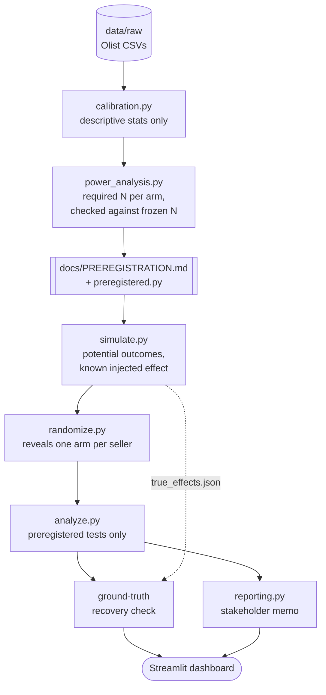

# Experiment Design & Power Analysis for a Shipping Policy Change

A preregistered, simulated A/B testing pipeline that asks whether free shipping raises average order value without meaningfully raising complaint rates. The original design (metric, minimum lift, sample size, tests) was committed before the simulation code.

Olist data calibrates the simulation only. Because the experiment is simulated, the true effect is known and the analysis can be checked against it.

## Preview

<p align="center">
  
  <br>
  <sub>Main landing view: final verdict and all four tabs.</sub>
</p>

> Additional screenshots are in [`assets/`](assets/). Stakeholder memo is generated to [`results/memo.md`](results/memo.md).

## What this is

The project answers "does free shipping raise AOV without hurting satisfaction?" in seven steps:

1. **Calibrate** simulation parameters from real Olist orders, using descriptive statistics only.
2. **Compute** the required sample size and record the design in `docs/PREREGISTRATION.md`, with the numeric constants frozen in `src/design/preregistered.py`.
3. **Simulate** a population with a known injected effect (potential outcomes), matching the calibrated seller-level AOV spread that sized the study.
4. **Randomize** sellers into arms, revealing one potential outcome per seller and discarding the counterfactual.
5. Run the **analysis** once, on the full dataset, at the preregistered sample size.
6. Check the result against the effect realized in the simulated population and against the injected parameter.
7. Generate a stakeholder memo and a dashboard from the saved output files.

`design/` establishes the design, including the frozen constants. `experiment/` executes it and reads those constants without modifying them.

## Architecture


```mermaid
flowchart TD
    raw[(data/raw\nOlist CSVs)] --> calib[calibration.py\ndescriptive stats only]
    calib --> power[power_analysis.py\nrequired N per arm,\nchecked against frozen N]
    power --> prereg[[docs/PREREGISTRATION.md\n+ preregistered.py]]
    prereg --> sim[simulate.py\npotential outcomes,\nknown injected effect]
    sim --> rand[randomize.py\nreveals one arm per seller]
    rand --> analyze[analyze.py\npreregistered tests only]
    analyze --> recovery[ground-truth\nrecovery check]
    sim -.->|true_effects.json| recovery
    analyze --> memo[reporting.py\nstakeholder memo]
    recovery --> dash([Streamlit dashboard])
    memo --> dash
```

## Design decisions

| Decision | Choice | Why |
| --- | --- | --- |
| Primary metric | Mean per-seller AOV | Matches the unit of randomization |
| Primary MDE | BRL 25 absolute lift, also the minimum lift for a GO | Set just above an approximate BRL 23 freight cost per order (external figure, see limitations) |
| Guardrail metric | Complaint rate (review score of 2 or below) | Stops an AOV win masking a satisfaction loss; a proxy, not delivery-specific |
| Guardrail margin | 2.0pp non-inferiority | About a 15.7% relative increase on the 12.76% order-level baseline |
| Randomization unit | Seller, not order | Avoids interference within a seller's order stream |
| Primary test | Welch's t-test, two-sided | Allows unequal variance between arms |
| Guardrail test | One-sided, margin-shifted z-test on the order-weighted rate, seller-clustered standard errors | Tests non-inferiority directly and respects clustering |
| Guardrail outcomes | Passed, breached, inconclusive | Separates a measured problem from a precision problem |
| GO rule | Significant, positive, at least BRL 25, guardrail passed | The minimum lift drives the decision, not only the sample size |
| Required sample size | 2,503 sellers/arm, 5,006 total | Set by the primary metric; the guardrail needs about 142 sellers-equivalent |

## Design integrity safeguards

* **Fixed horizon.** `analyze()` has no sample-size argument. It takes N from `src/design/preregistered.py`, raises `PartialDatasetError` unless each arm has exactly that many sellers, and rejects a seller appearing in both arms.
* **Design drift check.** `power_analysis.py` raises `DesignDriftError` and writes nothing if the recomputed sample size differs from the frozen one, for example after `--recalibrate`.
* **One analysis per dataset.** `analyze.main()` raises `ReanalysisError` rather than overwrite a result computed on different data. Reruns on identical data reproduce the same output.
* **Dataset roles.** `analyze.py` and `reporting.py` cannot read raw Olist data. Only `check_ground_truth_recovery()` reads the injected-effect file, after the analysis has returned. AST tests verify both.
* **No leakage.** `randomize.py` reveals one potential outcome per seller and raises if a counterfactual column would reach the analysis data.
* **Balanced arms.** `randomize()` raises `ValueError` on an odd seller count.

These guard against accidental drift, not tampering: anyone with write access can edit the constants. Git history is the real lock.

## Data

* `data/raw/`: real Olist CSVs, user-supplied and gitignored. Read only by `calibration.py`, for descriptive statistics.
* `data/calibration/calibration_params.json`: committed, and the only bridge from real data to the simulation. Holds per-category AOV and complaint parameters, the baseline complaint rate, the seller-level AOV standard deviation, the orders-per-seller distribution, and order-level and seller-level category weights. `simulate.py` uses the seller-level weights because it draws sellers, not orders. The file predates the mean freight per order and dropped-order fields; they appear after a recalibration.
* `data/simulated/`: synthetic population and assignment, regenerable from fixed seeds and gitignored, except the committed `true_effects.json` (injected and realized effects).
* `results/`: `power_analysis.json`, `analysis_results.json`, `recovery_check.json`, `memo.md`.

Source: [Olist Brazilian E-Commerce Public Dataset](https://www.kaggle.com/datasets/olistbr/brazilian-ecommerce) on Kaggle. Check its license before reusing the data or the committed calibration statistics.

## Getting started

Developed on Python 3.11.9. The dashboard needs a Streamlit release that supports `width="stretch"` on buttons and charts.

```bash
python -m venv .venv
source .venv/bin/activate
pip install -r requirements.txt

python scripts/run_pipeline.py
streamlit run dashboard/app.py
pytest tests/ -v
```

The pipeline runs `power → simulate → randomize → analyze → report`, reusing the committed calibration. To rebuild it, place these files in `data/raw/` and pass `--recalibrate`, which runs calibration first:

```text
olist_orders_dataset.csv
olist_order_items_dataset.csv
olist_order_reviews_dataset.csv
olist_products_dataset.csv
product_category_name_translation.csv
```

```bash
python scripts/run_pipeline.py --recalibrate
```

Recalibration can change the required sample size. If it does, the pipeline stops at the power step with `DesignDriftError` until the preregistration and `preregistered.py` are amended deliberately. The pipeline never modifies `docs/PREREGISTRATION.md`.

No install step is needed beyond dependencies: the scripts, dashboard, and tests add `src/` to `sys.path`. To run one module directly, from the repository root:

```bash
PYTHONPATH=src python -m design.calibration
```

Notes:

* The committed `results/` let the dashboard run immediately. If `results/` is missing, the dashboard shows a prompt.
* Results come from fixed seeds. If your NumPy version yields a different random stream, `analyze.main()` raises `ReanalysisError` against the committed `results/analysis_results.json`. Delete that file and rerun.

## Evaluation

A total of 71 tests, divided in four groups:

* **Statistics:** power calculation, guardrail estimator and its three outcomes, decision rule.
* **Design integrity:** frozen sample size, drift detection, fixed-horizon and one-analysis rules, balanced and leak-free randomization, and AST checks that raw data and the injected effect cannot reach analysis or reporting code.
* **Statistical validation:** simulation against calibration, plus 100 randomizations of one simulated population. Mean estimates must sit within BRL 3.00 and 0.1pp of the realized effects, 95% intervals must cover them at least 90% of the time, the guardrail must pass in over 60% of draws and be breached in under 5%, and the GO rate must fall between 45% and 80%.
* **Output and hygiene:** memo rendering and wording; no comments, em dashes, unused imports, or deprecated Streamlit arguments.

## Results

The committed run (simulation seed 20260904, randomization seed 71) injects a BRL 28.00 AOV lift and a 1.2pp complaint increase. The simulated population realizes BRL 30.84 and +1.35pp, and a confidence interval from one run targets the realized values, so recovery is judged against them. The simulated seller-level AOV standard deviation matches the calibrated 315.58.

| Metric | Point estimate | 95% CI | Realized | Injected | Recovered? |
| --- | ---: | --- | ---: | ---: | --- |
| AOV lift | BRL 38.07 | [BRL 21.32, BRL 54.82] | BRL 30.84 | BRL 28.00 | Yes |
| Complaint rate difference | +1.73pp | [+1.18pp, +2.27pp] | +1.35pp | +1.20pp | Yes |

The verdict is **NO-GO**: the guardrail is **inconclusive**, not breached. Mean seller AOV rose from BRL 134.02 to BRL 172.09 (p = 8.6e-06), clearing the BRL 25 minimum. Complaints rose from 12.18% to 13.90% of orders, a 1.73pp gap under the 2.0pp margin, but the margin-shifted test (z = -0.98, one-sided p = 0.163) did not establish non-inferiority, and the rule requires positive evidence that the gap is below the margin. This reflects limited precision, not harm: with a standard error of about 0.28pp, post hoc and unpreregistered power is roughly 89% at a true 1.2pp gap and 75% at the realized 1.35pp. It is also one draw, so it does not show the method generalizes to every real-world effect.

## Known limitations

* **Recovery is a smoke test.** A correct 95% interval still misses about one run in twenty.
* **Guardrail sizing is approximate.** The 142 sellers-equivalent per arm comes from a pooled, order-level, two-sided calculation that ignores within-seller correlation and answers a different question from the test that runs.
* **The guardrail metric is a proxy.** A review of 2 or below is not specific to delivery, and the simulation generates complaints independently of delivery, so no change can be attributed to delivery.
* **Unverified or lossy inputs.** Multi-seller orders (1.3%) are credited whole to the seller of the lowest `order_item_id`, which can inflate that seller's AOV. Orders missing a category or seller are dropped.
* **Simplified simulation.** Only seller-level AOV standard deviation and category mix are matched to calibration. Order volume is independent of category and complaint propensity, no cross-seller interference is assumed, and the baselines reflect Olist's category mix and the Brazilian market.
