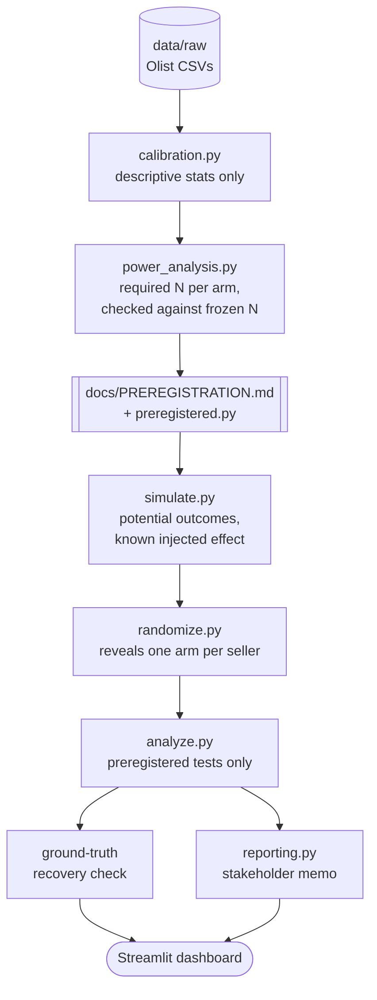

# Experiment Design & Power Analysis for a Shipping Policy Change

A preregistered, simulated A/B testing pipeline that asks whether free shipping raises average order value without meaningfully raising complaint rates. The metric, minimum lift, sample size, and tests are fixed in a preregistration written before the simulation code; later corrections are logged openly in that document.

Olist data calibrates the simulation only. Because the experiment is simulated, the true effect is known and the analysis can be checked against it.

## Preview

<p align="center">
  
  <br>
  <sub>Main landing view: final verdict and all four tabs.</sub>
</p>

> Additional screenshots are in [`assets/`](assets/). The current stakeholder memo is generated to [`results/memo.md`](results/memo.md).

## What this is

The project answers "does free shipping raise AOV without hurting satisfaction?" in seven steps:

1. Calibrate simulation parameters from real Olist orders, using descriptive statistics only.
2. Compute the required sample size and record the design in `docs/PREREGISTRATION.md`, with the numeric constants frozen in `src/design/preregistered.py`.
3. Simulate a population with a known injected effect (potential outcomes), matching the calibrated seller-level AOV spread that sized the study.
4. Randomize sellers into arms, revealing one potential outcome per seller and discarding the counterfactual.
5. Run the preregistered tests once, at the preregistered sample size.
6. Check the result against the effect realized in the simulated population and against the injected parameter.
7. Generate a stakeholder memo and a dashboard from the saved output files.

`design/` establishes the design, including the frozen constants. `experiment/` executes it and reads those constants without modifying them.

## Architecture


```mermaid
flowchart TD
    raw[(data/raw\nOlist CSVs)] --> calib[calibration.py\ndescriptive stats only]
    calib --> power[power_analysis.py\nrequired N per arm,\nchecked against frozen N]
    power --> prereg[[docs/PREREGISTRATION.md\n+ preregistered.py]]
    prereg --> sim[simulate.py\npotential outcomes,\nknown injected effect]
    sim --> rand[randomize.py\nreveals one arm per seller]
    rand --> analyze[analyze.py\npreregistered tests only]
    analyze --> recovery[ground-truth\nrecovery check]
    analyze --> memo[reporting.py\nstakeholder memo]
    recovery --> dash([Streamlit dashboard])
    memo --> dash
```

Full section-by-section design rationale, including the post-hoc amendment log, is in [`docs/PREREGISTRATION.md`](docs/PREREGISTRATION.md).

## Design decisions

| Decision             | Choice                                    | Why                                                         |
| -------------------- | ----------------------------------------- | ----------------------------------------------------------- |
| Primary metric       | Mean per-seller AOV                       | Matches the unit of randomization                           |
| Primary MDE          | BRL 25 absolute lift, also the minimum lift for a GO | Set near an approximate BRL 23 freight cost per order (external figure, see limitations) |
| Guardrail metric     | Complaint rate (review score of 2 or below) | Stops an AOV win masking a satisfaction loss; a proxy, not delivery-specific |
| Guardrail margin     | 2.0pp non-inferiority                     | About a 15.7% relative increase on the 12.76% order-level baseline |
| Randomization unit   | Seller, not order                         | Avoids interference within a seller's order stream          |
| Primary test         | Welch's t-test, two-sided                 | Allows unequal variance between arms                        |
| Guardrail test       | One-sided, margin-shifted z-test on the order-weighted rate, seller-clustered standard errors | Matches the order-level baseline and margin, tests non-inferiority directly, respects clustering |
| Guardrail outcomes   | Passed, breached, inconclusive            | Separates a measured problem from a precision problem       |
| GO rule              | Significant, positive, at least BRL 25, guardrail passed | The minimum lift drives the decision, not only the sample size |
| Required sample size | 2,503 sellers/arm, 5,006 total            | Set by the primary metric                                   |

## Guardrails

* **Fixed horizon.** `analyze()` has no sample-size argument. It takes N from `src/design/preregistered.py`, raises `PartialDatasetError` unless each arm has exactly that many sellers, and rejects a seller appearing in both arms.
* **Design drift check.** `power_analysis.py` raises `DesignDriftError` and writes nothing if the recomputed sample size differs from the frozen one, for example after `--recalibrate`.
* **One analysis per dataset.** `analyze.main()` raises `ReanalysisError` rather than overwrite a result computed on different data. Reruns on identical data reproduce the same output.
* **Dataset roles.** `analyze.py` and `reporting.py` cannot read raw Olist data, and only `check_ground_truth_recovery()` may read the injected-effect file, after the analysis has returned. AST tests verify both.
* **No leakage.** `randomize.py` reveals one potential outcome per seller and raises if a counterfactual column would reach the analysis data.
* **Balanced arms.** `randomize()` raises `ValueError` on an odd seller count instead of silently unbalancing the split.

These guard against accidental drift, not tampering: anyone with write access can edit the constants. Git history is the real lock.

## Data

* **`data/raw/`**: real Olist CSVs, user-supplied and gitignored. Used only by `calibration.py`, for descriptive statistics.
* **`data/calibration/`**: the committed `calibration_params.json`, the only bridge from real data to the simulation. It holds per-category AOV and complaint parameters, the baseline complaint rate, the seller-level AOV standard deviation, the orders-per-seller distribution, and two category weightings: `category_weights` (share of orders) and `category_weights_seller_level` (share of sellers). `simulate.py` requires the seller-level weights, since it draws sellers, not orders. `calibration.py` also computes mean freight per order and counts dropped orders; the committed file does not contain those two fields until you recalibrate.
* **`data/simulated/`**: synthetic population and assignment, regenerable from fixed seeds and gitignored, except the committed `true_effects.json`, which records the injected parameters and the realized effects.
* **`results/`**: power analysis, analysis results, recovery check, and memo.

Olist is used here only to calibrate the simulation.

## Project structure

```text
.
├── README.md
├── requirements.txt
├── .gitignore
│
├── docs/
│   └── PREREGISTRATION.md       # experimental design and amendment log
│
├── .streamlit/
│   └── config.toml              # dashboard theme
│
├── assets/
├── data/
│   ├── raw/                     # Olist CSVs, user supplied, gitignored
│   ├── calibration/             # committed calibration_params.json
│   └── simulated/               # regenerable simulation data, true_effects.json committed
│
├── src/
│   ├── design/
│   │   ├── calibration.py       # descriptive calibration
│   │   ├── preregistered.py     # frozen design constants
│   │   └── power_analysis.py    # sample-size calculation and drift check
│   │
│   └── experiment/
│       ├── simulate.py          # potential outcomes
│       ├── randomize.py         # treatment assignment
│       ├── analyze.py           # preregistered analysis
│       └── reporting.py         # verdict, memo content, memo
│
├── dashboard/
│   └── app.py                   # Streamlit results dashboard
│
├── results/
│   ├── power_analysis.json
│   ├── analysis_results.json
│   ├── recovery_check.json
│   └── memo.md
│
├── scripts/
│   └── run_pipeline.py
│
└── tests/
```

## Getting started

### 1. Data

The committed `calibration_params.json` is enough to run the pipeline. To recalibrate, place these Olist files in `data/raw/`:

```text
olist_orders_dataset.csv
olist_order_items_dataset.csv
olist_order_reviews_dataset.csv
olist_products_dataset.csv
product_category_name_translation.csv
```

Recalibration can change the required sample size. If it does, `power_analysis.py` stops the pipeline with `DesignDriftError` until the preregistration and `preregistered.py` are amended deliberately.

### 2. Install

Developed on Python 3.11.9. `requirements.txt` bounds every dependency; the dashboard needs a Streamlit release that supports `width="stretch"` on buttons and charts.

```bash
python -m venv .venv
source .venv/bin/activate
pip install -r requirements.txt
```

The project needs no install step: `scripts/run_pipeline.py`, `dashboard/app.py`, and the tests add `src/` to `sys.path`. To run a single module directly, from the repository root (`src` is a relative path):

```bash
PYTHONPATH=src python -m design.calibration
```

### 3. Run

```bash
python scripts/run_pipeline.py
streamlit run dashboard/app.py
pytest tests/ -v
```

The pipeline reuses the committed calibration by default. To rebuild it from `data/raw/`:

```bash
python scripts/run_pipeline.py --recalibrate
```

Steps run in this order:

```text
power → simulate → randomize → analyze → report
```

Notes:

* The committed `results/` let the dashboard run immediately; rerun the pipeline only to regenerate them. If `results/` is missing, the dashboard shows a prompt.
* Results come from fixed seeds. If your NumPy version yields a different random stream, `analyze.main()` raises `ReanalysisError` against the committed `results/analysis_results.json`. Delete that file and rerun.
* The pipeline never modifies `docs/PREREGISTRATION.md`, and stops at the first step if the recomputed sample size differs from the frozen one.

## Evaluation

The 71 tests cover the pipeline from calibration to reporting, in four groups. Unit tests check the statistics: the power calculation, the guardrail estimator and its three outcomes, and the decision rule. Design-integrity tests check the preregistration guards: the frozen sample size, drift detection, the fixed-horizon and one-analysis rules, balanced and leak-free randomization, and AST checks that raw data and the injected effect cannot reach the analysis or reporting code. Statistical-validation tests check the simulation against its calibration, confirm over 100 randomizations that both estimators are unbiased and their intervals cover the realized effects, and confirm the recovery check catches a deliberately broken `randomize()`. Output tests check that the memo renders correctly and that its wording matches the outcome.

## Results

The committed run (simulation seed 20260904, randomization seed 71) injects a BRL 28.00 AOV lift and a 1.2pp complaint increase. Being random draws, the simulated population actually realizes BRL 30.84 and +1.35pp. A confidence interval from one randomized run targets the realized values, so recovery is judged against them. The simulated seller-level AOV std matches the calibrated 315.58 that sized the study.

| Metric                    | Point estimate | 95% CI                 | Realized  | Injected  | Recovered? |
| ------------------------- | -------------: | ---------------------- | --------: | --------: | ---------- |
| AOV lift                  |      BRL 38.07 | [BRL 21.32, BRL 54.82] | BRL 30.84 | BRL 28.00 | Yes        |
| Complaint rate difference |        +1.73pp | [+1.18pp, +2.27pp]     |   +1.35pp |   +1.20pp | Yes        |

The verdict is **NO-GO**, because the guardrail could not be resolved, not because it was breached. Mean seller AOV rose from BRL 134.02 to BRL 172.09 (p = 8.6e-06), clearing the BRL 25 minimum. Complaints rose from 12.18% to 13.90% of orders, a 1.73pp gap that is under the 2.0pp margin. But the margin-shifted test (z = -0.98, one-sided p = 0.163) did not establish non-inferiority, so the status is **inconclusive**: the interval [+1.18pp, +2.27pp] straddles the margin, and the rule requires positive evidence that the gap is below it.

The realized gap (1.35pp) is inside the margin, so this NO-GO reflects limited precision, not harm. With a standard error of about 0.28pp, back-of-envelope power to establish non-inferiority is roughly 89% at a true 1.2pp gap and roughly 75% at the realized 1.35pp. These are post hoc, not preregistered.

This is one draw. Over the 100 randomizations used in `test_estimator_calibration.py`, mean estimates were BRL 30.36 and +1.33pp (realized: BRL 30.84 and +1.35pp), and the 95% intervals covered the realized effects in 99% (AOV) and 95% (complaints) of draws. The guardrail passed in 84% of draws, was inconclusive in 16%, and was never breached; the full rule returned GO in 66%. The committed NO-GO is a less favorable draw, not the typical outcome. One seeded run does not show that the method generalizes to every real-world effect.

## Known limitations

* **Recovery is a smoke test.** A correct 95% interval still misses about one run in twenty.
* **Guardrail power is not preregistered.** Sizing uses a pooled, order-level, two-sided calculation (142 sellers-equivalent per arm), so the primary metric binds at 2,503. It ignores within-seller correlation and answers a different question from the test that runs; a matched calculation needs per-seller complaint variance, which calibration lacks. The dashboard's 80% power applies to the order value test only.
* **The guardrail metric is a proxy.** A review of 2 or below is not specific to delivery, and the simulation generates complaints independently of delivery, so no change can be attributed to delivery.
* **The BRL 23 freight figure is unverified here.** The raw Olist files are not in the repo and the committed calibration does not contain the freight field. Treat it as an external approximation until you recalibrate.
* **Multi-seller orders go to one seller.** Calibration credits a whole order to the seller of its lowest `order_item_id`, which can inflate that seller's AOV. The share is in the calibration file's data quality notes. Orders missing a category or seller are dropped; recalibration reports how many.
* **The simulation matches calibration on few moments.** Seller-level AOV std and category mix are matched. Order volume is independent of category and complaint propensity, and the seller-level AOV mean is not stored, so the simulated mean is checked against the category mix.
* **No cross-seller interference is assumed**, though competition for the same customers could leak effects between arms.
* **Calibration is marketplace-specific.** Baselines reflect Olist's category mix and the Brazilian market.